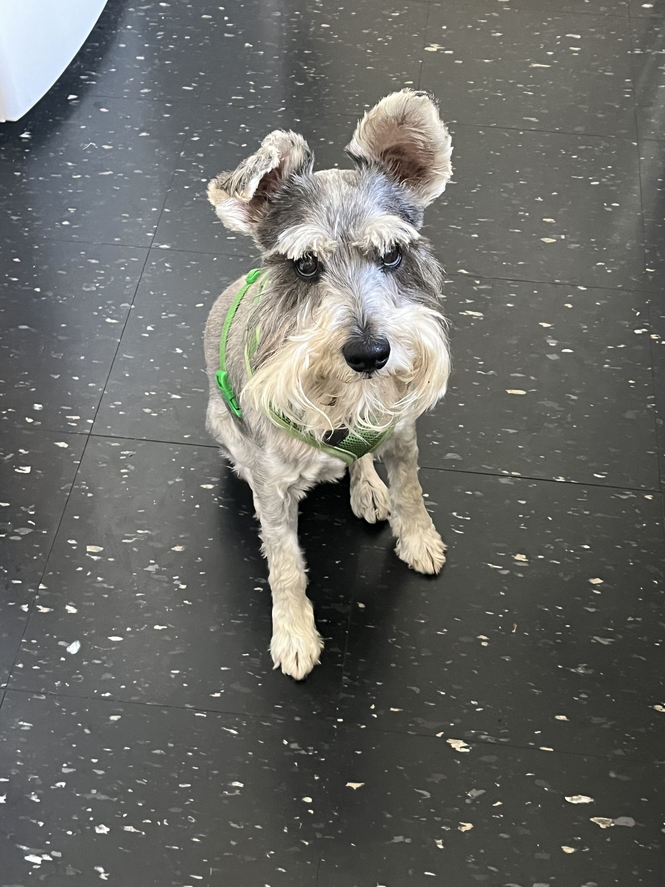

#### Samuel Wagner

I'm currently working at [Vanilla](https://www.justvanilla.com/) on estate planning tools for the financial planning industry. Previously, I ran a small design and development studio, Gaucho.

At work, I'm interested in performance tuning Ruby codebases, writing code that's meant to be read, and being a good coworker and team member.

After a decade living in Los Angeles, I recently completed a cross-country move and find myself in Ridgewood, Queens. My miniature schnauzer Merlin came along for the ride and is adjusting begrudgingly to our new home.

[GitHub](https://github.com/samuel-wags) - [LinkedIn](https://www.linkedin.com/in/samuel-wagner-223307106/)

